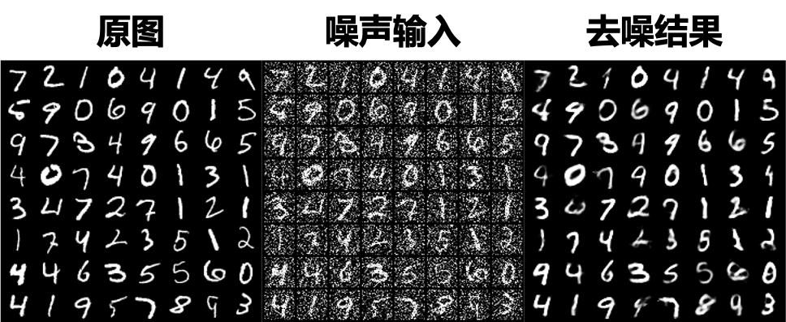
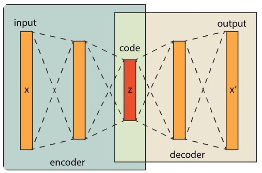

# Denoising AutoEncoder 自编码器图像去噪

> 23Spring 重庆大学计算机学院 深度学习课程项目-任务8

<div align=center>
    
</div>

## 0. 问题描述
在神经网络世界中，对图像数据进行建模需要特殊的方法。其中最著名的是卷积神经网络(CNN或ConvNet)或称为卷积自编码器。自编码器是一种神经网络结构，它由两个子网络组成，即编码和解码网络，它们之间通过一个潜在空间相互连接。

## 1. 自编码器模型

### 1.1 DAE 去噪自编码器

最简单的Encoder-Decoder结构，以MLP为基础

<div align=center>
    
</div>

### 1.2 DCAE 卷积自编码器

将DAE中的MLP替换为卷积神经网络

### 1.3 VAE 变分自编码器

与自编码器通过数值的方式描述潜在空间不同，以概率的方式描述对潜在空间。在原DAE的基础上，还具有生成能力

<div align=center>
    
</div>

## 2. 代码框架

```
─── Denoising_AE/
    └── data/
        ├── MNIST
    └── checkpoints/
        └── DAE.pth
        └── DCAE.pth
        └── VAE.pth
    └── models/
    	└── DAE.py
        └── DCAE.py
        └── VAE.py
    └── results/
        └── VAE_test/
            ├── origin.png
            ├── noisy.png
            ├── reconstructed.png
        └── DAE_test
        └── DCAE_test
    └── scripts/
        └── VAE/
            ├── train.sh
            ├── test.sh
        └── DAE
        └── DCAE
    └── train.py
    └── predict.py
    └── scripts.ipynb
```

## 3. 代码运行

### 3.1 数据集下载

若已有MNIST数据集，将其放在`/data/`文件夹中。若没有数据集，则将`train.py`中第38行的`download`设置为`True`，将会自动下载数据集至`/data/`文件夹中

### 3.2 模型训练

> 若为Colab或华为Notebook运行，可在`scripts.ipynb`文件中运行

在`/Denoising_ae/`路径下运行：

```shell
sh scripts/[选择模型]/train.sh
```

在`scripts/[选择模型]/train.sh`中可进行超参数调整，可调整的超参数有：

- **batch_size**  批量大小 - 默认值`32`

- **lr** 学习率 - 默认`1e-3`

- **num_epochs** 训练轮次 - 默认`10`

- **input_dim** `DAE`和`VAE`输入数据维数 - 默认`784`（MNIST数据集图像大小为`28*28`）

- **hidden_dim** `DAE`和`VAE`隐藏层数据维数 - 默认`400`

- **output_dim** `DAE`和`VAE`隐空间`z`维数 - 默认`20`

- **ae_model_type** 模型类型 - 默认`DAE`， 可选`[DAE, DCAE, VAE]`

- **log_dir** `Tensorboard log`文件输出地址 - 默认`./logs`

- **model_save_path** 模型`checkpoints`保存地址 - 默认`./checkpoints`

- **device** GPU选择 - 默认`'0'` （第0块gpu）

运行完成后，模型训练得到的Checkpoints保存在`checkpoints`文件夹中。训练过程写入`Tensorboard`中，`log`文件保存在`./logs`中，查看训练过程可运行:

```shell
tensorboard --logdir=./logs --port 6006

```

若为服务器运行，可先用`ssh`实现服务器远程端口到本地端口的转发：

```shell
ssh -L 6006:127.0.0.1:6006 hostname@my_server_ip
```

### 3.3 模型预测

在完成训练后，或已有模型`Checkpoints`后，可在`MNIST`数据集上测试模型去噪效果（确保数据集已下载且放在`/data/`文件夹中）。

在`/Denoising_ae/`路径下运行：

```shell
sh scripts/[选择模型]/predict.sh
```

预测部分同样可以在`scripts/[选择模型]/predict.sh`中可进行超参数调整，可调整的超参数有：

- **batch_size**  批量大小 - 默认值`32`

- **load_model_path** 模型checkpoints地址 

- **num_epochs** 训练轮次 - 默认`10`

- **input_dim** `DAE`和`VAE`输入数据维数 - 默认`784`（MNIST数据集图像大小为`28*28`）

- **hidden_dim** `DAE`和`VAE`隐藏层数据维数 - 默认`400`

- **output_dim** `DAE`和`VAE`隐空间`z`维数 - 默认`20`

- **ae_model_type** 模型类型 - 默认`DAE`， 可选`[DAE, DCAE, VAE]`

- **device** GPU选择 - 默认`'0'` （第0块gpu）

！！注意 `input_dim, hidden_dim, output_dim` 需要与训练时指定值保持一致 

输出结果为`origin.png, noisy.png, reconstructed.png`. 分别为`MNIST`的原始图像，加噪声的图像和模型去噪得到的图像

## 参考文献
``` 
1. Image Denoising and Inpainting with Deep Neural Networks
2. How to Reduce Image Noises by Autoencoder
3. Building Autoencoders in Keras
```